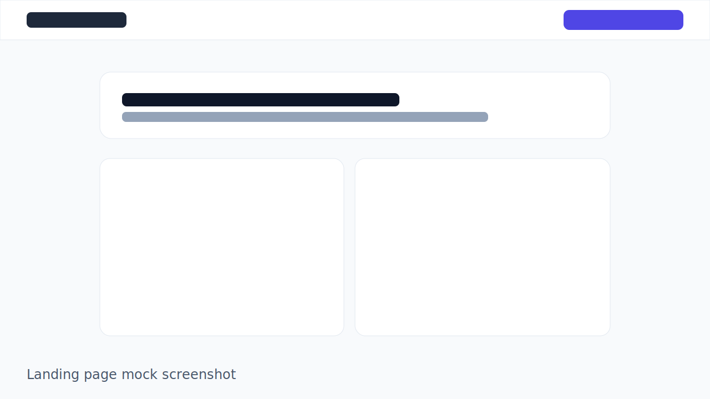
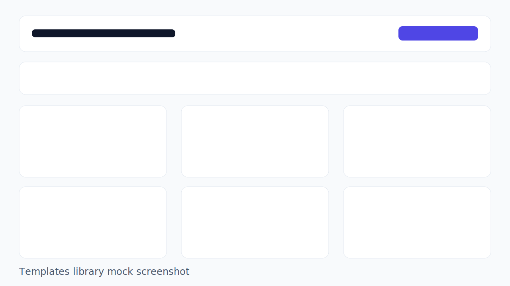
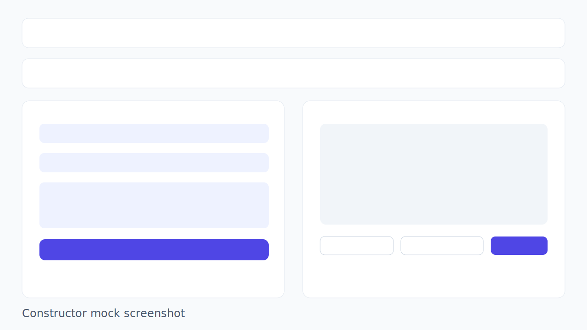

# CopyCraft AI


SaaS MVP для рієлторів: генерація маркетингових текстів для нерухомості через динамічні шаблони, з auth, бібліотекою шаблонів, конструктором і demo-білінгом.

**Live Demo:** https://copycraft-ai.vercel.app  
**Repository:** https://github.com/chasov-artem/copycraft-ai

## Архітектура

Проект побудований на **Next.js App Router**, стан користувача та сесії працює через **React Context**, дані зберігаються в **Firestore**, а платежі реалізовано як **mock-сервіс**, що імітує Stripe/Paddle checkout + webhook flow для MVP-демо.

Початковий стек проекту: **Next 13 + TypeScript + Tailwind + shadcn/ui** (поточна версія — Next.js 14).

- **Frontend:** Next.js 14, TypeScript, Tailwind CSS, shadcn/ui, framer-motion
- **Auth/Data:** Firebase Auth + Firestore
- **Billing:** Mock payment service (`checkout`, `subscription`, `webhook`)
- **Routing:** App Router (`app/`)

## Скріншоти

### Лендінг



### Бібліотека шаблонів



### Конструктор



## Ключові фічі

- Лендінг з тарифами і CTA
- Реєстрація/логін через Firebase Auth
- Бібліотека шаблонів з фільтрами за категоріями, тегами та пошуком
- Конструктор шаблону з динамічними полями і mock AI-генерацією
- Demo checkout + subscription billing + webhook
- Адаптивний UI і мікроанімації

## Локальний запуск

1. Встановіть залежності:

```bash
npm install
```

2. Заповніть `.env.local`:

```bash
NEXT_PUBLIC_FIREBASE_API_KEY=...
NEXT_PUBLIC_FIREBASE_AUTH_DOMAIN=...
NEXT_PUBLIC_FIREBASE_PROJECT_ID=...
NEXT_PUBLIC_FIREBASE_STORAGE_BUCKET=...
NEXT_PUBLIC_FIREBASE_MESSAGING_SENDER_ID=...
NEXT_PUBLIC_FIREBASE_APP_ID=...
NEXT_PUBLIC_FIREBASE_MEASUREMENT_ID=...
NEXT_PUBLIC_APP_URL=http://localhost:3000
```

3. (Опційно) засійте шаблони:

```bash
npm run seed:templates
```

4. Запустіть проект:

```bash
npm run dev
```

5. Відкрийте `http://localhost:3000`.

## Payment Implementation (Mock)

У проекті реалізовано повний demo-цикл SaaS-оплати без зовнішніх платіжних SDK:

- `lib/mock-payment-service.ts`
  - `createCheckoutSession(priceId, userId)`
  - `verifyPayment(sessionId)`
  - `cancelSubscription(userId)`
- `app/checkout/page.tsx` — старт checkout
- `app/checkout/mock-session/[sessionId]/page.tsx` — форма оплати з Luhn-валідацією
- `app/api/mock-webhook/route.ts` — імітація `checkout.session.completed`
- `app/dashboard/billing/page.tsx` — керування підпискою
- `lib/subscription-service.ts` — синхронізація статусу підписки в Firestore

Це дозволяє показати архітектуру production SaaS ще до інтеграції реального провайдера.

## Деплой на Vercel

```bash
vercel --prod
```

Після деплою додайте env-змінні у Vercel Project Settings -> Environment Variables.
